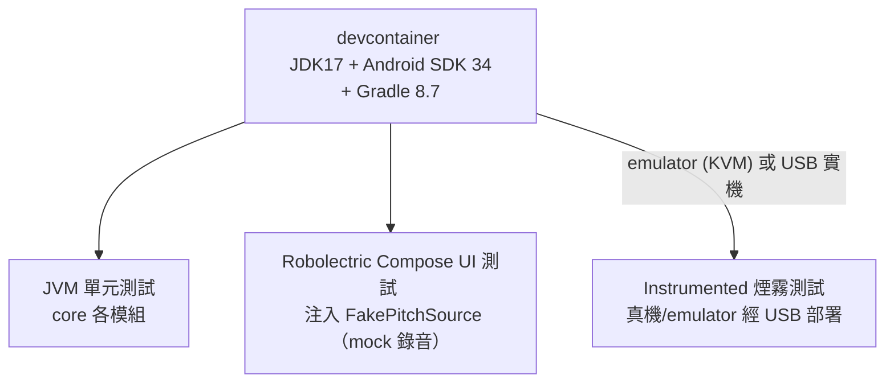

# 2. 架構限制

> arc42 第 2 章。上層：[文件索引](index.md)。相關：[1. 介紹與目標](01_introduction_and_goals.md) ｜ [4. 解決策略](04_solution_strategy.md)。

本章列出架構與設計**必須遵守**的限制。這些限制不是設計選擇，而是邊界條件，直接影響 [4. 解決策略](04_solution_strategy.md) 的每一項決策。

## 2.1 技術限制

| 編號 | 限制 | 來源／依據 |
|---|---|---|
| T1 | 原生 Android App，語言為 **Kotlin** | `app/build.gradle.kts`：`org.jetbrains.kotlin.android` |
| T2 | UI 全用 **Jetpack Compose（Material3）**，主題 `Theme.CelloCoach`；單一 Activity，狀態切換不引入 Navigation 套件 | `build.gradle.kts` `buildFeatures.compose=true`、Compose BOM `2024.06.00`；`CONTRACTS.md` UI 行為 |
| T3 | **JDK 17**（source/target 17，`jvmTarget=17`） | `build.gradle.kts` `compileOptions` / `kotlinOptions`；devcontainer 用 `eclipse-temurin:17-jdk-jammy` |
| T4 | `compileSdk=34`、`targetSdk=34`、`minSdk=26` | `build.gradle.kts` `defaultConfig` |
| T5 | Compose 編譯器擴充 `1.5.14`（相容 Kotlin 1.9.24） | `composeOptions.kotlinCompilerExtensionVersion` |
| T6 | **MusicXML 解析不可用 music21**；以 JDK `javax.xml`（DocumentBuilder）自行解析，並自動偵測 `.mxl` 的 ZIP magic bytes（"PK"）解壓 | `CONTRACTS.md` `core/ScoreLoader.kt` |
| T7 | 音高偵測在裝置上自行實作（NSDF／normalized autocorrelation，McLeod 風格），不依賴 librosa／Pitchy／Web Audio | `CONTRACTS.md` `core/PitchDetector.kt`；對比原 README 技術棧 |
| T8 | 麥克風以 `AudioRecord` 背景執行緒擷取（~20Hz），`RECORD_AUDIO` 權限由 UI 層取得 | `CONTRACTS.md` `audio/AudioPitchSource.kt` |
| T9 | 校正持久化用 app `filesDir/tuning.json`（純文字 JSON，含 `savedAt` ISO 時間），等價原版 `~/.cello-practice/tuning.json` | `CONTRACTS.md` `data/TuningStore.kt` |
| T10 | **禁止新增未在 `app/build.gradle.kts` 宣告的相依** | `CONTRACTS.md` 樣式/相依 |

## 2.2 組織與流程限制

| 編號 | 限制 | 依據 |
|---|---|---|
| O1 | `CONTRACTS.md` 是**單一事實來源**：所有模組的套件、類別、函式簽章須嚴格遵守，否則無法整合編譯（並行開發 agent 共用） | `CONTRACTS.md` 開頭 |
| O2 | 行為須與 Python 參考實作對齊（`score_loader.py`、`pitch_detector.py`、`score_follower.py`、`scorer.py`、`tuning.py`、`main.py`），部分模組要求**逐行移植**並保留相同常數 | `CONTRACTS.md` 各模組；如 `ScoreFollower` 的 `ADVANCE_THRESHOLD_TICKS=5`、`LOOKAHEAD=3`、`TIMEOUT_FACTOR=2.5` |
| O3 | 已存在的 `core/ScoreNote.kt`、`core/Pitch.kt` 不可重寫 | `CONTRACTS.md` 已存在區段 |
| O4 | 開發、建置、測試在 **devcontainer** 內進行 | `.devcontainer/Dockerfile` + `devcontainer.json` |

## 2.3 開發環境限制（devcontainer）

devcontainer 把建置與測試環境完全固定下來：

- 基底 `eclipse-temurin:17-jdk-jammy`，安裝 Android SDK（platform 34、build-tools 34.0.0、platform-tools）、emulator + `system-images;android-34;google_apis;x86_64`、Gradle 8.7、adb/usb 工具。
- KVM 硬體加速 emulator（`--device=/dev/kvm`）。
- 連接實機：`--device=/dev/bus/usb` + `--privileged`（USB 透過 usbipd-win 轉進 WSL2），或透過 `ADB_SERVER_SOCKET=tcp:host.docker.internal:5037` 橋接 WSL2 host 上的 adb server。
- Gradle 快取以 named volume `cellocoach-gradle` 持久化。
- 非 root 使用者 `vscode`，工作目錄 `/workspace`。

這直接支撐品質目標「可測試性」：

- **JVM 單元測試**（`app/src/test`）：`com.cellocoach.core` 各模組，無 Android 相依。
- **Robolectric Compose UI 測試**（`app/src/test`）：`@RunWith(RobolectricTestRunner::class)` + `createComposeRule()`，注入 `FakePitchSource` 餵腳本音高，做「mock 錄音」的 e2e 螢幕驗證，**免 emulator**，可在 devcontainer 內跑。
- **Instrumented 測試**（`app/src/androidTest`）：一支煙霧測試，於真機／emulator 啟動 App 驗證主畫面。

## 2.4 慣例

| 慣例 | 說明 |
|---|---|
| 套件結構 | `core`（純 Kotlin 演算法）／`audio`（麥克風）／`data`（持久化）／`ui`（Compose + ViewModel）／`MainActivity` |
| 測試掛勾 | 所有可測 UI 元件加 `Modifier.testTag(...)`，tag 命名集中於 `ui/TestTags.kt`（例：`home_start`、`tuning_skip`、`practice_cursor`、`report_score`） |
| 校正四捨五入 | `Tuning.asMap()` 偏移量四捨五入到 0.1 |
| 文件語言 | 架構文件用繁體中文；Mermaid 圖遵循 GitLab 相容語法 |

---

這些限制如何塑形模組劃分，見 [4. 解決策略](04_solution_strategy.md)。系統邊界（為何沒有 server）見 [3. 系統脈絡與範圍](03_context_and_scope.md)。
