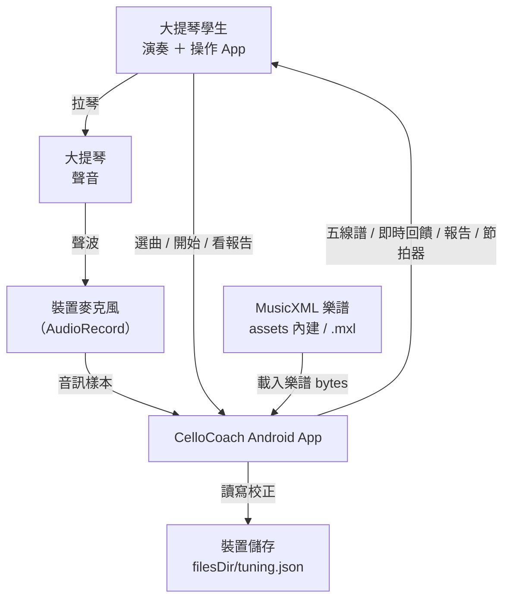
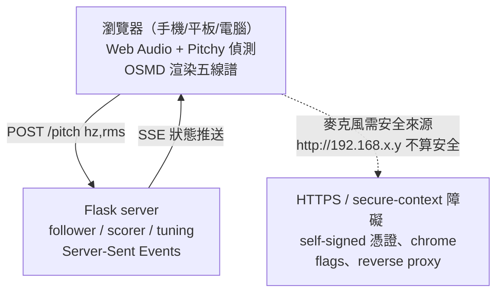
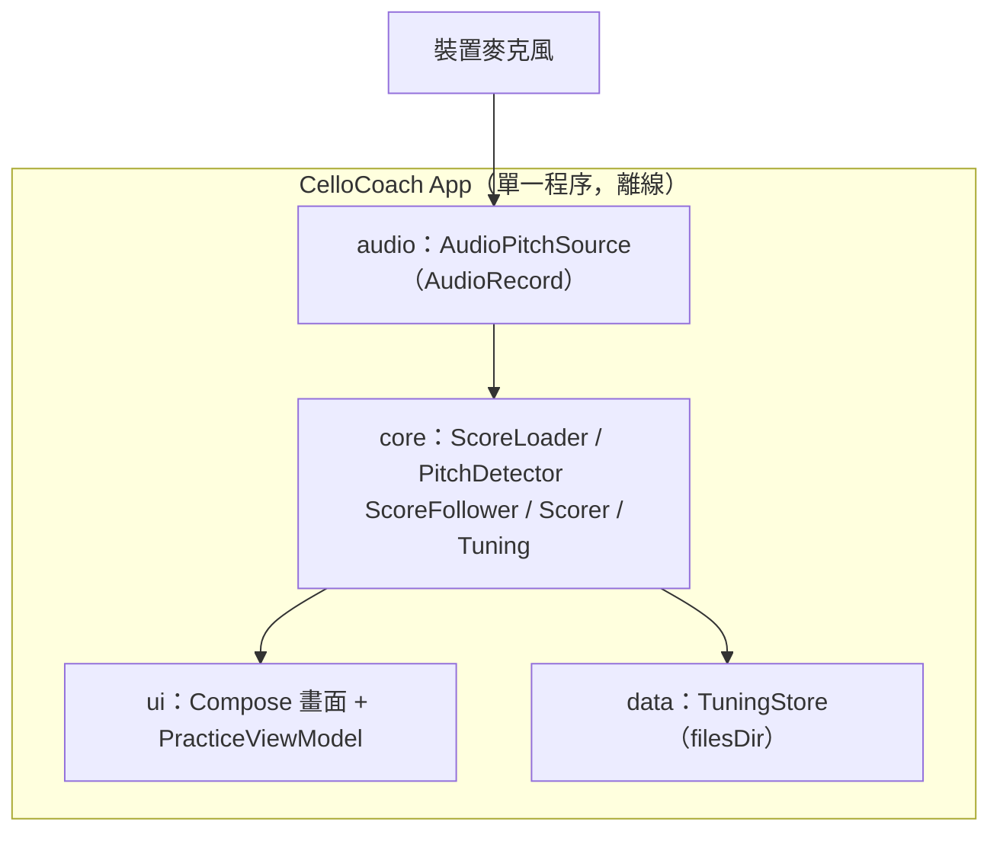

# 3. 系統脈絡與範圍

> arc42 第 3 章。上層：[文件索引](index.md)。相關：[1. 介紹與目標](01_introduction_and_goals.md) ｜ [2. 架構限制](02_architecture_constraints.md) ｜ [4. 解決策略](04_solution_strategy.md)。

本章界定 CelloCoach Android App 的邊界：哪些在系統內、哪些是外部、以及與原始 Web 架構的根本差異。

## 3.1 業務脈絡

CelloCoach 是一支**自給自足、離線、單一裝置**的 App。沒有後端、沒有網路服務、沒有跨裝置通訊。所有外部互動都發生在裝置本機。

### 外部介面（皆在裝置本機）

| 外部實體 | 方向 | 介面 | 內容 |
|---|---|---|---|
| 學生 | 雙向 | 麥克風 + 觸控螢幕 | 演奏聲音輸入；選曲、開始、校正、看報告 |
| 大提琴 + 麥克風 | 入 | `AudioRecord`（~20Hz） | PCM 音訊樣本 → 音高偵測 |
| MusicXML 樂譜 | 入 | App assets（內建 `g_major_scale.musicxml` 等）；支援 `.xml`/`.musicxml`/`.mxl` | 樂譜 bytes，解析為音符 timeline |
| 裝置檔案系統 | 雙向 | `filesDir/tuning.json` | 四弦校正偏移持久化 |

**沒有的外部介面**：沒有 HTTP server、沒有瀏覽器、沒有 LAN／雲端連線、沒有 SSE、沒有 `POST /pitch`、沒有外部網路呼叫。

## 3.2 技術脈絡：與原始 Web 架構對比

原始版本（`/home/lane/music_code/`）把運算拆在瀏覽器與 Flask 之間，這正是 README 中所有連線痛點的根源。

### 原始架構（Flask + 瀏覽器）

痛點（README 整段說明）：瀏覽器僅允許在「安全來源」存取麥克風，`http://localhost` 算安全但 `http://192.168.x.y` 與雲端 IP **不算**。從 LAN／行動裝置使用時，學生被迫在三條繞道中擇一——加 `--ssl` 跑 self-signed HTTPS（再手動略過瀏覽器警告）、改 `chrome://flags/#unsafely-treat-insecure-origin-as-secure` 加白名單、或把 server 放在 reverse proxy（caddy/nginx/cloudflare tunnel）後終結 TLS。

### Android 架構（單一 App，全部 on-device）

麥克風擷取、音高偵測、跟譜、計分、校正、UI 渲染全在同一程序內，以函式呼叫與 Kotlin 協程連接，取代原本的 HTTP/SSE。**因此 HTTPS／secure-context／LAN 連線設定的整類問題從架構上消失**——麥克風存取只需一次 Android `RECORD_AUDIO` 執行期權限。

### 對應表

| 面向 | 原始 Web 版 | Android 版 |
|---|---|---|
| 音高偵測位置 | 瀏覽器（Pitchy + Web Audio） | App 內 `core/PitchDetector`（NSDF）+ `audio/AudioPitchSource` |
| 跟譜／計分／校正 | Flask server | App 內 `core` 模組 |
| 五線譜渲染 | OpenSheetMusicDisplay（CDN） | 原生 Compose `ScoreView` |
| 元件間通訊 | HTTP `POST /pitch` + SSE | 程序內函式呼叫 + 協程 / StateFlow |
| 樂譜解析 | music21 | `javax.xml` DocumentBuilder（自解 `.mxl` ZIP） |
| 校正儲存 | `~/.cello-practice/tuning.json` | app `filesDir/tuning.json` |
| 網路需求 | 需要（LAN/HTTPS 設定） | 無（完全離線） |
| 麥克風授權 | 瀏覽器安全來源規則 | Android `RECORD_AUDIO` 權限一次 |

## 3.3 範圍

**範圍內**：MusicXML 載入（含 `.mxl`）、即時音高偵測、DTW 風格單向跟譜、逐音計分與自動診斷、四弦校正與存檔、節拍器 4 拍倒數、原生五線譜與即時回饋 UI、練習報告。

**範圍外**（沿用原版已知限制）：跟譜僅能往前（學生回頭重拉前段不會倒回）；指法對應簡化（高把位一律算最高開弦套校正偏移）；只追蹤第一個 part（不適合多聲部）；無 OMR（只支援已有 MusicXML 的曲目）；校正 JSON 無 schema 版本管理。

---

模組如何各司其職，見 [4. 解決策略](04_solution_strategy.md)。
