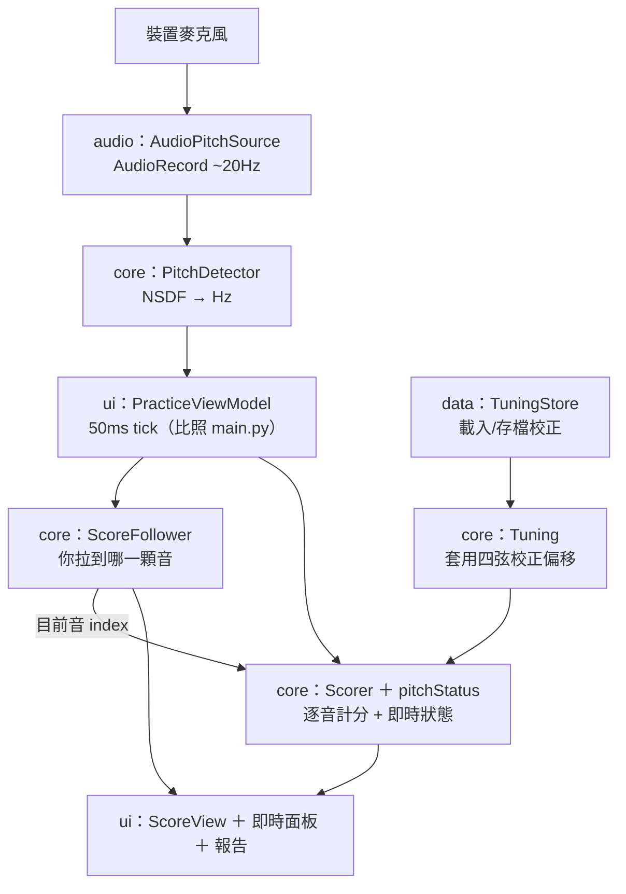

# 4. 解決策略

> arc42 第 4 章。上層：[文件索引](index.md)。相關：[1. 介紹與目標](01_introduction_and_goals.md) ｜ [2. 架構限制](02_architecture_constraints.md) ｜ [3. 系統脈絡與範圍](03_context_and_scope.md)。

本章把 [1. 介紹與目標](01_introduction_and_goals.md) 的問題與品質目標，連到 [2. 架構限制](02_architecture_constraints.md) 之下的具體技術決策。

## 4.1 關鍵架構決策

| 決策 | 內容 | 解決的目標／限制 |
|---|---|---|
| D1 全 on-device 單一 App | 把瀏覽器＋Flask 的拆分合併成單一 Android 程序，元件間用函式呼叫與協程，取代 HTTP/SSE | G7（移除 HTTPS/secure-context/LAN 痛點）、品質目標「易用性」「可離線性」 |
| D2 純 Kotlin core 層 | 演算法集中於 `com.cellocoach.core`，**無 Android 相依**，可在 JVM 純測 | 品質目標「正確性」「可測試性」、限制 O2（與 Python 對齊） |
| D3 逐行移植 Python | follower/scorer/tuning/loader 比照參考實作，保留相同常數與邏輯 | G2/G3/G5、限制 O1/O2 |
| D4 自寫 MusicXML 與音高偵測 | 不用 music21／Pitchy／librosa；`javax.xml` 解析、NSDF 偵測 | 限制 T6/T7、品質目標「可離線性」 |
| D5 `PitchSource` 介面抽象 | 真機 `AudioPitchSource` 與測試用 `FakePitchSource` 共用介面，可注入 | 品質目標「可測試性」（mock 錄音 e2e） |
| D6 單一 Activity + Compose 狀態切換 | 四個畫面以 Compose 狀態切換，不引入 Navigation 套件 | 限制 T2、減少相依（T10） |
| D7 ViewModel 集中協調 | `PracticeViewModel` 持有 follower/scorer/tuning，訂閱 `PitchSource`，50ms tick 比照 `main.py` 迴圈，以 `State`/`StateFlow` 暴露 | G1/G2、品質目標「即時性」 |

## 4.2 README 功能 → Android 模組對應

下表把原始 README 的每項功能，對應到負責的 Android 模組與其 Python 參考來源。模組簽章以 `CONTRACTS.md` 為準。

| README 功能 | 對應目標 | 主要 Android 模組（套件） | 協作模組 | Python 參考 |
|---|---|---|---|---|
| 顯示真譜面（五線譜 + 隨演奏移動光標） | G1 | `ui/ScoreView`（`com.cellocoach.ui`，原生 Compose 繪製） | `ui/PracticeViewModel`、`core/ScoreFollower` | OSMD 前端（取代）|
| 載入 MusicXML（含 `.mxl`） | G1 | `core/ScoreLoader`（`javax.xml`，自解 ZIP） | `core/ScoreNote` | `score_loader.py` |
| 即時音高偵測 | G2 | `core/PitchDetector`（NSDF）+ `audio/AudioPitchSource`（AudioRecord ~20Hz） | `audio/FakePitchSource`（測試）、`core/Pitch` | `pitch_detector.py` + Pitchy/Web Audio（取代）|
| 即時音準回饋（應拉 vs 你拉、cents、綠/橘/紅） | G2 | `core/pitchStatus`（GOOD/CLOSE/OFF/WRONG）+ `ui` 即時面板 | `core/Scorer`、`core/Tuning` | `scorer.py` + `main.py` status 判定 |
| DTW 風格跟隨（拉慢/拉快/跳音/暫停） | G5 | `core/ScoreFollower`（單向，常數 `ADVANCE_THRESHOLD_TICKS=5`/`LOOKAHEAD=3`/`TIMEOUT_FACTOR=2.5`，注入 `Clock`） | `core/ScoreNote` | `score_follower.py` |
| 練習報告（總分/對音 X/Y/平均 cents/逐音明細） | G3 | `core/Scorer`（`NoteResult`/`NoteSummary`/`PracticeSummary`）+ `ui/Report` 畫面 | `core/Tuning`（校正偏移） | `scorer.py` + `main.py` |
| 自動診斷（重複錯音/系統性偏移/整體偏高低） | G3 | `core/Scorer`（`diagnostics` 產生繁中字串） | `core/Tuning`、`core/stringForMidi` | `scorer.py` + README 診斷規則 |
| 調音校正（拉四條空弦 C→G→D→A） | G4 | `core/Tuning`（`calibrateString`/`offsetCentsForMidi`/`nextUncalibrated`）+ `ui/Tuning` 畫面 | `audio/AudioPitchSource`、`core/PitchDetector` | `tuning.py` |
| 校正存檔（下次自動套用） | G4 | `data/TuningStore`（`filesDir/tuning.json`，含 `savedAt`） | `core/Tuning` | `tuning.py` save/load（路徑改 `filesDir`）|
| 節拍器倒數（開始前 4 拍，依 BPM） | G6 | `ui/PracticeViewModel`（倒數狀態）+ `ui` 節拍器/倒數 | `core/LoadedScore.bpm` | `main.py` tick loops |
| 移除 HTTPS/LAN 連線痛點 | G7 | 整體架構（單一 App，無 server） | — | 取代 Flask + SSE + `--ssl` |

## 4.3 運作流程概觀

練習一回合的端到端資料流（決策 D1/D5/D7 的落地）：

要點：
- `PitchSource` 介面讓測試以 `FakePitchSource` 餵腳本音高，在 devcontainer 內免 emulator 驗證整條鏈（D5、見 [2.3](02_architecture_constraints.md)）。
- `ScoreFollower` 注入 `Clock`，取代 Python 的 `time.monotonic()`，使跟譜邏輯可在單元測試中以假時鐘決定性驗證（D2/D3）。
- 校正偏移由 `Tuning` 提供給 `Scorer`，讓 cents 反映「演奏誤差」而非「琴的走音」（G4）。

---

更細的建構區塊與執行期視圖將於第 5、6 章補上（見 [文件索引](index.md)）。
