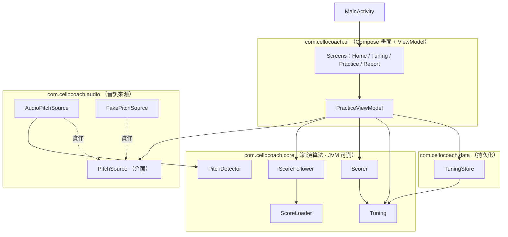
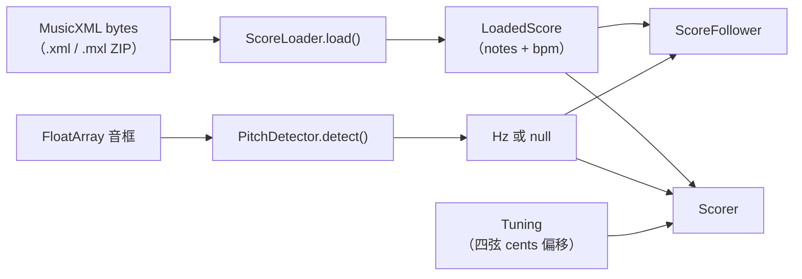
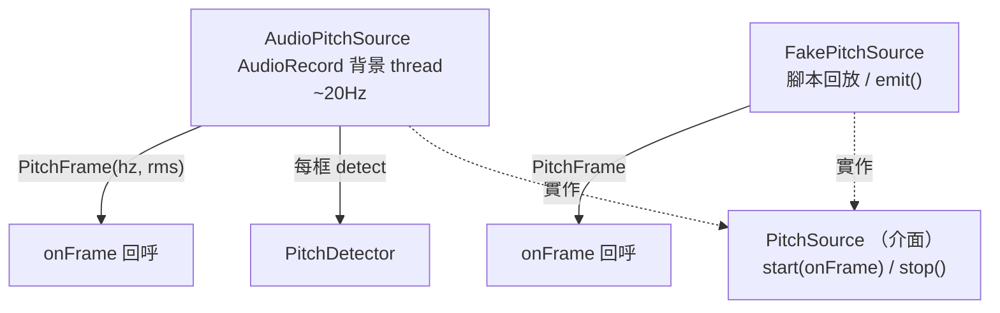
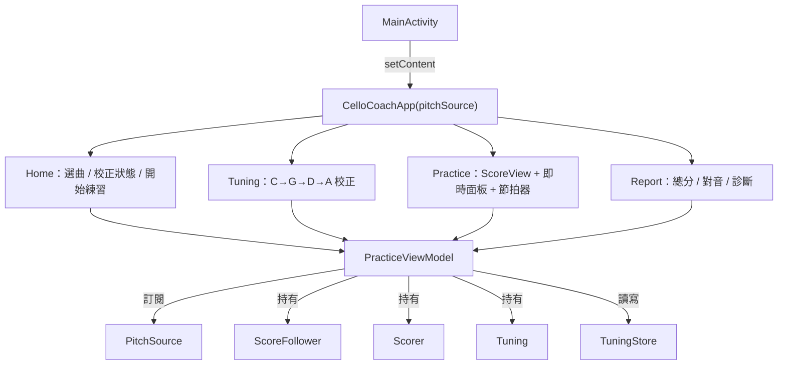

# 5. 建構區塊視圖（Building Block View）

本節以靜態分解的方式描述 CelloCoach Android App 的程式碼結構。系統把原 Python 參考實作（`/home/lane/music_code/`，瀏覽器偵測音高 → POST 給 Flask 的架構）全部內聚到 App 內，移除了 HTTPS / secure-context / LAN 連線的痛點（參見 [README](../../../music_code/README.md) 與 [CONTRACTS.md](../../CONTRACTS.md)）。

相關章節：執行期互動見 [06 執行視圖](06_runtime_view.md)，部署環境見 [07 部署視圖](07_deployment_view.md)，演算法與橫切設計見 [08 橫切概念](08_crosscutting_concepts.md)。

## 5.1 整體分解（Level 1）

系統依套件分層，核心演算法層（`core`）為純 Kotlin、無 Android 相依，可在 JVM 單元測試中執行；其餘各層圍繞它組裝。

### 包含的建構區塊

| 區塊 | 套件 | 職責 |
|---|---|---|
| 核心演算法 | `com.cellocoach.core` | 樂譜解析、音高偵測、跟譜、計分、調音 — 純運算，無 Android API |
| 音訊來源 | `com.cellocoach.audio` | 麥克風擷取與測試假來源，統一以 `PitchSource` 介面對外 |
| 資料持久化 | `com.cellocoach.data` | 校正結果存取（等價於原 `~/.cello-practice/tuning.json`） |
| UI | `com.cellocoach.ui` | Compose 四畫面 + `PracticeViewModel` 狀態機 |
| 入口 | `com.cellocoach.MainActivity` | `setContent` → `CelloCoachApp(pitchSource)` |

## 5.2 Level 2 — core 演算法層

`core` 是系統的心臟，逐一移植自 Python 參考模組。`ScoreNote` 與 `Pitch.kt`（含 `midiToHz`、`hzToMidi`、`centsBetween`、`PitchFrame`、`PitchSource`、`Clock`）已存在，不重寫。

### 5.2.1 ScoreLoader

- 簽章：`object ScoreLoader { fun load(bytes: ByteArray, bpmOverride: Double? = null): LoadedScore }`
- 移植 `score_loader.py`，但**禁用 music21**；以 JDK `javax.xml`（`DocumentBuilder`）自行解析 MusicXML。
- 自動偵測 ZIP magic bytes（`bytes[0]=='P' && bytes[1]=='K'`），解壓並從 `META-INF/container.xml` 的 rootfile 取主譜 XML。
- 只取第一個 part（單聲部），逐 measure 累積時間；rests 也保留在 timeline。
- tempo 優先序：`bpmOverride` > 樂譜 `<sound tempo>`／`<metronome>` > 預設 120。
- 解析細節（divisions、chord、backup/forward、MIDI 換算）見 [08.1](08_crosscutting_concepts.md#81-樂譜解析-musicxml)。

### 5.2.2 PitchDetector

- 簽章：`class PitchDetector(sampleRate=44100, fmin=60.0, fmax=1100.0, clarityThreshold=0.9) { fun detect(samples: FloatArray): Float? }`
- 移植瀏覽器端 Pitchy 的 normalized autocorrelation（McLeod-style NSDF）。純運算。
- 找過 `clarityThreshold` 的最高 peak，拋物線內插求精確 lag，`hz = sampleRate / lag`；超出 `[fmin, fmax]` 或 RMS 過低回 `null`。演算法見 [08.2](08_crosscutting_concepts.md#82-音高偵測演算法)。

### 5.2.3 ScoreFollower

- 簽章：`class ScoreFollower(notes: List<ScoreNote>, clock: Clock = SystemClock)`，方法 `start / started / isDone / expectedNote / currentNoteIdx / elapsed / observe`。
- **逐行移植** `score_follower.py`。常數 `ADVANCE_THRESHOLD_TICKS=5`、`LOOKAHEAD=3`、`TIMEOUT_FACTOR=2.5`。
- 以注入的 `Clock` 取代 Python 的 `time.monotonic()`（秒 = nanos / 1e9），使其在測試中可被假時鐘驅動。
- 前進邏輯（hard timeout、rest 依時間、重複同音 80% 前進、lookahead hysteresis）見 [08.4](08_crosscutting_concepts.md#84-跟譜遲滯-hysteresis-與前進邏輯)。

### 5.2.4 Scorer（含診斷）

- 移植 `scorer.py` + `main.py` 的 status 判定 + 自動診斷。
- 每 tick 由 `observe(noteIdx, detectedHz)` 把樣本歸入「應在響的那顆音」，累積 `samples / voicedSamples / correctSamples / centsValues / voicedMidiCounts`。
- `summary()` 產出 `PracticeSummary`（總分、對音數、平均 cents、每顆音 `NoteSummary`、繁中診斷字串）。
- `pitchStatus()` 提供即時 GOOD/CLOSE/OFF/WRONG。計分數學與診斷規則見 [08.3](08_crosscutting_concepts.md#83-計分數學-sustain--intonation)。

### 5.2.5 Tuning

- `STRINGS`（C36 G43 D50 A57）、`Tuning` 類別含 `isCalibrated / calibrateString / offsetCentsForMidi / clear / asMap / nextUncalibrated`。
- 「note → 弦」採「最高且 nominal ≤ note 的開弦」啟發式。偏移模型見 [08.5](08_crosscutting_concepts.md#85-調音偏移模型)。

## 5.3 Level 2 — audio 音訊層

- `PitchSource`（已定義於 `core/Pitch.kt`）是 UI 與音訊來源之間的抽象縫合點，讓 `PracticeViewModel` 可在實機注入 `AudioPitchSource`、在測試注入 `FakePitchSource`。
- `AudioPitchSource`：以 `AudioRecord` 在背景 thread 約 20 Hz 讀取，每框送 `PitchDetector.detect()` → `onFrame(PitchFrame(hz, rms))`。假設 `RECORD_AUDIO` 權限已由 UI 層取得（見 [08.6](08_crosscutting_concepts.md#86-錯誤與權限處理)）。
- `FakePitchSource`：依腳本回放或手動 `emit()` 逐格驅動，供 Robolectric / Compose 預覽免真實麥克風使用。

## 5.4 Level 2 — data 持久化層

- `class TuningStore(dir: File)`：`load(): Tuning?`（不存在／壞檔／四弦不齊回 `null`）、`save(tuning)`（僅 `isCalibrated` 時寫入，含 `savedAt` ISO 時間）、`savedAt(): String?`。
- 寫入 `filesDir/tuning.json`，等價於 Python 的 `~/.cello-practice/tuning.json`。純文字 JSON，無 schema 版本管理（已知技術債）。

## 5.5 Level 2 — ui 層

- 單一 Activity + Compose 狀態切換，無 Navigation 套件。四畫面：**Home / Tuning / Practice / Report**。
- `PracticeViewModel` 是執行期協調者：持有 `ScoreFollower` + `Scorer` + `Tuning`，訂閱 `PitchSource`，跑 50ms tick 邏輯（比照 `main.py` 的 `_practice_tick_loop` 與 `_calibration_tick_loop`），以 Compose `State` / `StateFlow` 暴露狀態。互動時序見 [06 執行視圖](06_runtime_view.md)。
- 測試掛勾：可測元件加 `Modifier.testTag(...)`，tag 集中於 `ui/TestTags.kt`（如 `home_start`、`tuning_skip`、`practice_cursor`、`report_score`）。

## 5.6 Python 參考 → Kotlin 對應

| Python（`music_code`） | Kotlin（`com.cellocoach.*`） | 變化 |
|---|---|---|
| `score_loader.py`（music21） | `core/ScoreLoader` | 改用 `javax.xml` 自解析 |
| `pitch_detector.py`（瀏覽器持有者） | `core/PitchDetector` + `audio/AudioPitchSource` | 偵測移入 App，真正做 NSDF |
| `score_follower.py` | `core/ScoreFollower` | `time.monotonic` → 注入 `Clock` |
| `scorer.py` + `main.py` status/診斷 | `core/Scorer` + `pitchStatus()` | 合併 |
| `tuning.py` | `core/Tuning` + `data/TuningStore` | 演算法與持久化拆分 |
| `main.py` tick loops + Flask SSE | `ui/PracticeViewModel` | SSE/HTTP 改為 in-app StateFlow |
| `web/index.html`（OSMD） | `ui` Compose `ScoreView` | 原生繪製五線譜 |
