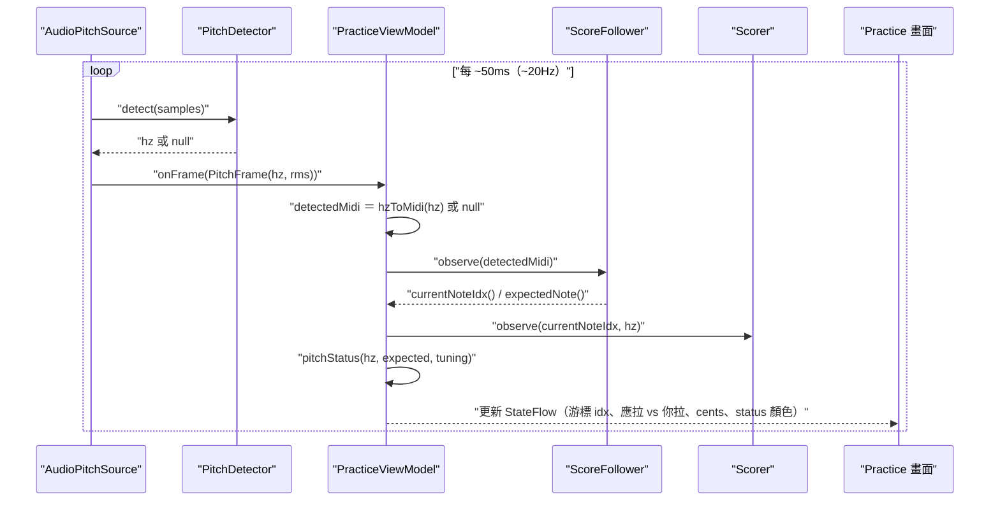
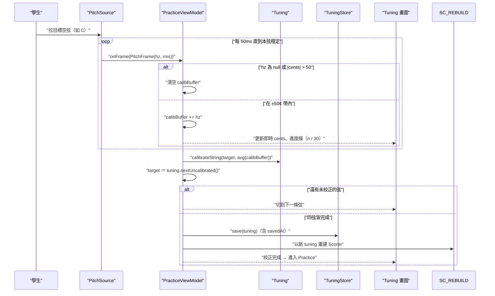
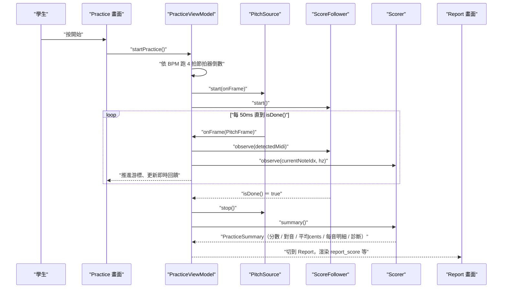
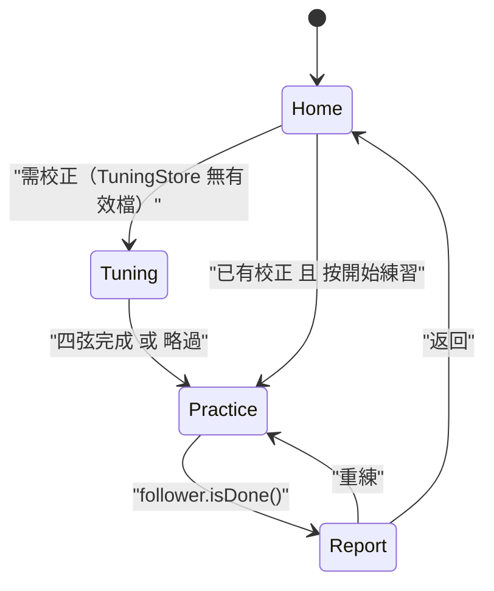

# 6. 執行視圖（Runtime View）

本節描述 CelloCoach 的關鍵執行期情境。所有迴圈邏輯比照 Python 參考實作 `main.py` 的 `_practice_tick_loop` 與 `_calibration_tick_loop`，但把原本「瀏覽器 POST → Flask SSE」的跨程序流，內聚成 App 內 `PracticeViewModel` 對 `PitchSource` 的訂閱與 50ms tick。

建構區塊定義見 [05 建構區塊視圖](05_building_block_view.md)；演算法細節見 [08 橫切概念](08_crosscutting_concepts.md)。

## 6.1 情境一：50ms 練習 tick 迴圈

這是練習過程的核心迴圈。`PitchSource` 約 20 Hz 推送 `PitchFrame`；`PracticeViewModel` 以 50ms 節奏（對齊 `main.py` 的 `time.sleep(0.05)`）執行「麥克風 → 偵測 → follower.observe → scorer.observe」，並更新 Compose 狀態驅動 UI。

要點：
- 順序固定為 **先 `follower.observe` 再 `scorer.observe`**，因 Scorer 要用 follower 剛更新的 `currentNoteIdx()` 來決定樣本歸到哪顆音（對齊 `_practice_tick_loop`）。
- 即使該 tick 沒偵測到音高（`detectedMidi == null`）仍要呼叫 `follower.observe(null)`，讓 hard timeout 能把卡住的音推進（見 [08.4](08_crosscutting_concepts.md#84-跟譜遲滯-hysteresis-與前進邏輯)）。
- ViewModel 是 follower 內部狀態的唯一寫者；Compose 端只讀，避免競態。

## 6.2 情境二：校正（Calibration）迴圈

開練前依序校正 C → G → D → A 四條空弦。比照 `_calibration_tick_loop`：每 tick 把落在目標弦 nominal ±50¢ 內的偵測值累積進 buffer，連續 `CALIB_REQUIRED_TICKS = 30` 格（約 1.5 秒）後取平均存為該弦偏移，前進下一弦；偵測為 null 或偏離 >50¢ 則清空 buffer 重來。

要點：
- 學生可在 Tuning 畫面「略過」（`tuning.clear()` → 直接進 Practice），此時 cents 以 A=440 為基準。
- 校正完成後必須以新的 `Tuning` **重建 Scorer**（對齊 Python 在 `_calibration_tick_loop` 完成時 `state["scorer"] = Scorer(...)`），否則計分仍用舊偏移。
- 若 `TuningStore.load()` 在啟動時回傳已校正的 `Tuning`，可直接跳過本流程進入 Practice（見 6.4）。

## 6.3 情境三：練習 → 報告（Practice → Report）

從按下「開始」到產生報告的完整序列：節拍器倒數 → tick 迴圈跑到 `follower.isDone()` → `Scorer.summary()` 快照一次 → 切換到 Report 畫面。

要點：
- 節拍器倒數依樂譜 BPM 給 4 拍預備 click，倒數結束才 `follower.start()`。
- `summary()` 在 `isDone()` 第一次成立時快照一次並快取（對齊 Python `last_summary` 的單次快照語意），避免報告數字在重渲染間漂動。
- 學生可在 Report 後重練：重建 `ScoreFollower` 與 `Scorer`（對齊 `/reset`），回到 6.1 / 6.3。

## 6.4 啟動與狀態切換總覽

- `MainActivity.setContent` → `CelloCoachApp(pitchSource)`，預設注入 `AudioPitchSource`；測試注入 `FakePitchSource` 以腳本音高驅動上述所有情境，達成免 emulator 的螢幕級 e2e 驗證（見 [07.4](07_deployment_view.md#74-測試執行拓樸)）。
- 麥克風權限若未取得，在進入需要收音的畫面前由 UI 層請求；拒絕時的退場見 [08.6](08_crosscutting_concepts.md#86-錯誤與權限處理)。
