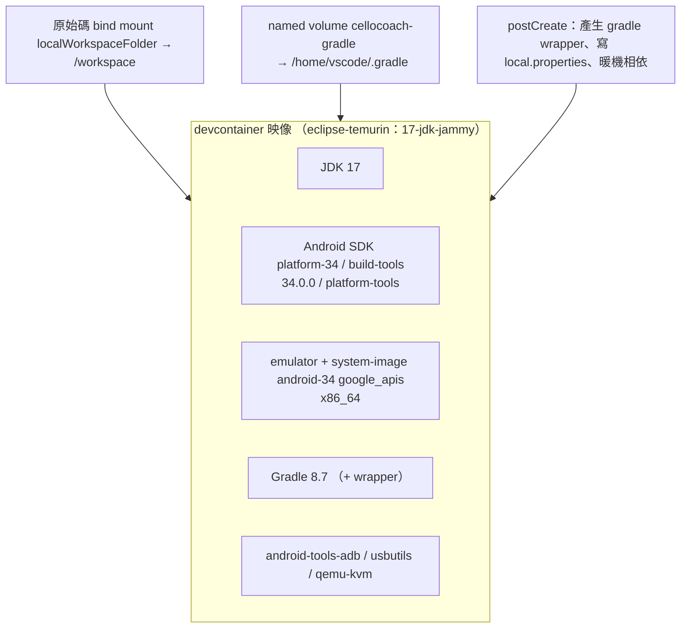
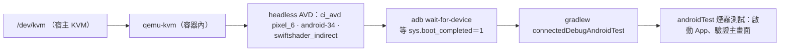
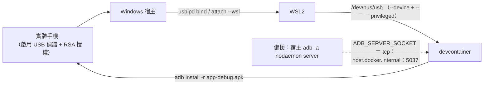
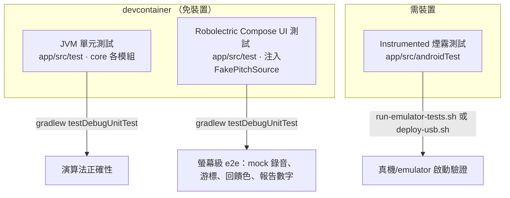

# 7. 部署視圖（Deployment View）

本節描述 CelloCoach 的建置、測試與佈署基礎設施。開發與 CI 都在一個 devcontainer 內進行；該容器同時支援兩條驗證路徑：KVM 加速的 emulator 跑 instrumented E2E，以及透過 USB passthrough 部署到實體手機。

對應檔案：[.devcontainer/Dockerfile](../../.devcontainer/Dockerfile)、[.devcontainer/devcontainer.json](../../.devcontainer/devcontainer.json)、[scripts/deploy-usb.sh](../../scripts/deploy-usb.sh)、[scripts/run-emulator-tests.sh](../../scripts/run-emulator-tests.sh)、[scripts/postcreate.sh](../../scripts/postcreate.sh)。建構區塊見 [05](05_building_block_view.md)，測試策略對應的執行情境見 [06](06_runtime_view.md)。

## 7.1 開發容器（devcontainer）

開發環境是一個以 `eclipse-temurin:17-jdk-jammy` 為基底的 Docker 映像，提供完整 Android 工具鏈。



| 元件 | 來源 / 設定 | 用途 |
|---|---|---|
| JDK 17 | 基底映像 | 與 `build.gradle.kts` 的 `sourceCompatibility = 17`／`jvmTarget = "17"` 對齊 |
| Android SDK | `sdkmanager` 安裝 platform-34、build-tools 34.0.0、platform-tools | 編譯（compileSdk 34、minSdk 26） |
| Emulator + system image | `system-images;android-34;google_apis;x86_64` | KVM 加速的 instrumented 測試 |
| Gradle 8.7 | 系統 Gradle 安裝；`postcreate.sh` 產生 wrapper | 建置與測試 |
| adb / usbutils / qemu-kvm | apt 安裝 | USB 部署與 KVM emulator |
| Gradle 快取 | named volume `cellocoach-gradle` → `/home/vscode/.gradle` | 跨重建持久化相依 |

容器以非 root 使用者 `vscode`、`WORKDIR /workspace` 執行。`runArgs` 帶 `--device=/dev/kvm`、`--device=/dev/bus/usb`、`--privileged`，分別支撐 emulator 加速與實機 USB。`postcreate.sh` 在建立後產生 gradle wrapper、寫 `local.properties`（`sdk.dir=${ANDROID_SDK_ROOT}`）並暖機相依。

## 7.2 KVM emulator 路徑（instrumented E2E）

`scripts/run-emulator-tests.sh` 在容器內建立一個 headless AVD 並跑 `connectedDebugAndroidTest`。需要容器以 `--device=/dev/kvm` 啟動才有硬體加速。



啟動旗標：`-no-window -no-audio -no-boot-anim -gpu swiftshader_indirect -no-snapshot`（純 headless CI 友善）。腳本以 trap 確保 emulator PID 在退出時被清掉。

## 7.3 USB passthrough 路徑（部署到實體手機）

在 WSL2 + Windows 宿主上，實體手機透過 `usbipd-win` 從 Windows 轉接進 WSL2，再經 `/dev/bus/usb` 進入 devcontainer，最後由 `adb` 連到手機。`scripts/deploy-usb.sh` 建置 debug APK 並安裝啟動。



宿主端前置步驟（見腳本與 [11 風險與技術債](11_risks_and_tech_debt.md)）：

```
# Windows PowerShell（系統管理員）
usbipd list
usbipd bind   --busid <id>
usbipd attach --wsl --busid <id>
```

`deploy-usb.sh` 流程：`adb devices -l` → `adb get-state`（無裝置即報錯退出）→ `./gradlew assembleDebug` → `adb install -r app/build/outputs/apk/debug/app-debug.apk` → `adb shell monkey ... LAUNCHER` 啟動。

**備援通道**：若不做原始 USB passthrough，可在 WSL2 宿主跑 `adb -a nodaemon server`，容器靠 `ADB_SERVER_SOCKET=tcp:host.docker.internal:5037` 找到手機（devcontainer.json 已設，未用時無害）。

## 7.4 測試執行拓樸

三層測試對應三種執行環境，前兩層都在 devcontainer 內、免實機與 emulator：



| 測試層 | 位置 | 執行方式 | 是否需裝置 |
|---|---|---|---|
| 單元（core） | `app/src/test` | `./gradlew testDebugUnitTest` | 否 |
| Robolectric Compose UI | `app/src/test` | `./gradlew testDebugUnitTest` | 否（注入 `FakePitchSource` 餵腳本音高） |
| Instrumented 煙霧 | `app/src/androidTest` | `run-emulator-tests.sh`（KVM）或 `deploy-usb.sh`（實機） | 是 |

Robolectric 層用 `FakePitchSource` 重放音高腳本，覆蓋 [06](06_runtime_view.md) 的校正、練習游標前進、回饋顏色與報告數字 — 這是「mock 錄音」的 e2e 螢幕驗證，可在 devcontainer 內免 emulator 執行。

## 7.5 約束

- 禁止新增未在 [app/build.gradle.kts](../../app/build.gradle.kts) 宣告的相依（見 [02 約束](02_constraints.md)）。
- emulator 路徑強依賴宿主 `/dev/kvm`；無 KVM 時 instrumented 測試會極慢或失敗，應改走 USB 實機路徑。
- USB passthrough 在 WSL2 上需 `usbipd-win` 與 `--privileged` 容器，屬已知環境脆弱點（見 [11](11_risks_and_tech_debt.md)）。
