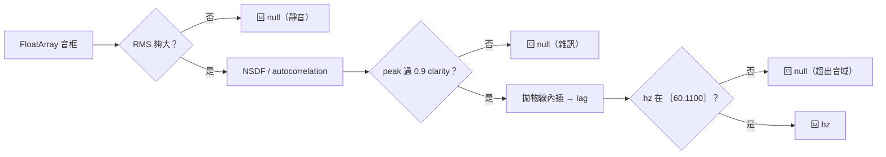
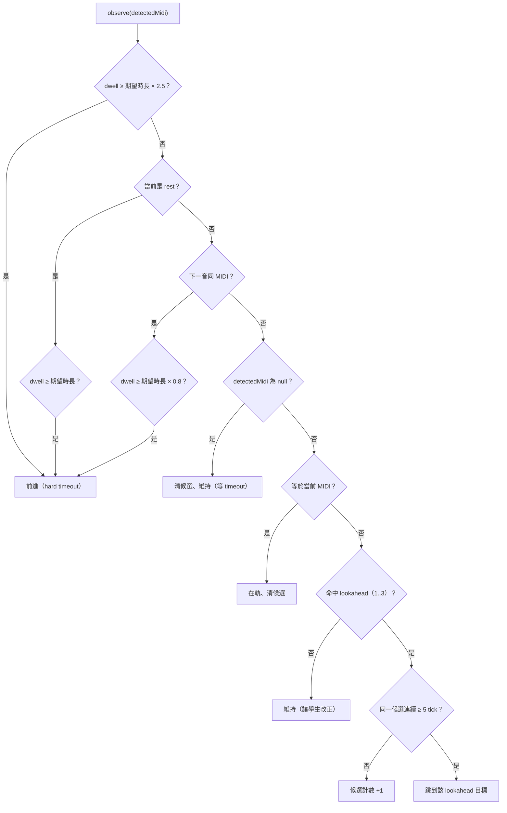

# 8. 橫切概念（Cross-cutting Concepts）

本節集中描述貫穿多個建構區塊的核心概念與演算法，是 [05 建構區塊](05_building_block_view.md) 與 [06 執行視圖](06_runtime_view.md) 反覆引用的設計依據。所有公式均移植自 Python 參考實作（`/home/lane/music_code/`），並遵守 [CONTRACTS.md](../../CONTRACTS.md) 的簽章。

## 8.1 樂譜解析（MusicXML）

`ScoreLoader` 把 MusicXML 攤平成單聲部 `ScoreNote` timeline（移植 `score_loader.py`，但以 `javax.xml` 取代 music21）。

- **容器偵測**：`bytes[0]=='P' && bytes[1]=='K'` → 視為 `.mxl` ZIP，讀 `META-INF/container.xml` 的 rootfile full-path 取主譜；否則取第一個非 META-INF 的 `.xml/.musicxml`。純 XML 則直接解析。
- **tempo 優先序**：`bpmOverride` > 第一個 `<sound tempo>`／`<metronome>`（beat-unit + per-minute） > 預設 120。`secPerQuarter = 60 / bpm`。
- **時間累積**：逐 measure，依 `<attributes><divisions>` 把 `<duration>/divisions` 換成 quarterLength。`<note>` 前進游標、`<backup>` 後退、`<forward>` 前進。
- **MIDI 換算**：`midi = (octave+1)*12 + stepSemitone[step] + alter`，`stepSemitone = C0 D2 E4 F5 G7 A9 B11`；name 用 `"$step$octave"`（有 alter 加 #/b）。
- **和弦**：含 `<chord/>` 者與前一個音同起點、取最高音、不前進游標。
- **rest**：`midi = REST(-1)`、`name="rest"`，**保留在 timeline**（與 Python 對齊，讓 follower/scorer 的時間軸一致）。
- 每音 `start = 游標(quarter) × secPerQuarter`，`end = start + quarterLength × secPerQuarter`。

## 8.2 音高偵測演算法

`PitchDetector`（移植 Pitchy 的 McLeod-style normalized autocorrelation）：

1. 先算 RMS；過低（靜音）直接回 `null`。
2. 計算 normalized square difference function（NSDF）/ autocorrelation。
3. 找第一個過 `clarityThreshold = 0.9` 的最高 peak。
4. 對該 peak 做**拋物線內插**求精確 lag，`hz = sampleRate / lag`。
5. 超出 `[fmin, fmax] = [60, 1100]`（大提琴音域，`CELLO_FMIN/FMAX`）回 `null`。



下游一律用 `hzToMidi`：`midi = round(69 + 12·log2(hz/440))`。實機端 `AudioPitchSource` 約 20 Hz 餵框；ViewModel 以 50ms tick 取用。

## 8.3 計分數學（sustain + intonation）

`Scorer` 每 tick 把樣本歸入 follower 指定的當前音，累積三個計數與 cents 清單（移植 `scorer.py`）：

| 計數 | 意義 |
|---|---|
| `samples` | 落在該音窗內的總 tick 數 |
| `voicedSamples` | 有偵測到音高的 tick |
| `correctSamples` | 偵測 MIDI 等於期望 MIDI 的 tick |

每音指標：

- `sustain = correctSamples / samples`（∈ [0,1]）。
- `cents` 記錄方式：當 `playedMidi == expectedMidi` 時，`rawCents = 1200·log2(hz / expectedFreq)`，再**扣掉該弦校正偏移**（見 8.5），存的是「演奏誤差」而非「樂器走音」。
- `intonation = max(0, 1 − trimmedMean(|cents|, 0.2) / 50)`。
- `score = (0.5·intonation + 0.5·sustain) × 100`。rest 的 `score = 100`，且不累積樣本。

**Trimmed mean（截尾平均，去頭尾各 20%）**：避免起弓瞬間的不穩把 intonation 拉低。

```
sorted = sort(values); k = floor(len·0.2)
middle = (len − 2k ≥ 1) ? sorted[k : len−k] : sorted
trimmedMean = mean(middle)
```

`summary()` 彙總：`score` = 各可演奏音 score 平均；`nCorrect` 以 `sustain > 0.5` 計（與 score 公式獨立）；`meanCents` = 全體 cents 的 trimmed mean；另含每音 `NoteSummary`（含 `modalPlayedMidi` — 該音最常被拉出的 MIDI，用來回答「拉錯時實際拉成什麼」）。

**即時 status**（`pitchStatus()`，比照 `main.py`）：先比 MIDI，不符 → `WRONG`；否則依 `|cents|`：`<20 GOOD`、`<50 CLOSE`、其餘 `OFF`。對應 UI 綠/橘/紅。

**自動診斷**（產生繁中字串，無問題則空 list）：

| 規則 | 觸發條件 | 訊息範式 |
|---|---|---|
| 整體偏移 | `|meanCents| ≥ 10` | 「整體音準偏{高/低} {x}¢」 |
| 重複錯音 | 同一 `expectedName` 出現 ≥2 次且都 `!pitchOk` | 「{name} 反覆拉錯（{n} 次）」 |
| 系統性偏移 | 某弦上的音平均 cents 偏移 ≥ 15 | 「{C/G/D/A} 弦的音普遍偏{高/低}」 |

## 8.4 跟譜遲滯（hysteresis）與前進邏輯

`ScoreFollower.observe(detectedMidi)`（逐行移植 `score_follower.py`）為**單向**前進，每 tick 依序判斷：



常數（`ADVANCE_THRESHOLD_TICKS=5`、`LOOKAHEAD=3`、`TIMEOUT_FACTOR=2.5`）的意義：

- **Hard timeout（×2.5）**：學生卡在某音太久（漏拍或偵測失敗）時強制前進，是安全網 — 因此每 tick 即使無音高也要呼叫 `observe(null)`。
- **重複同音 80%**：相鄰兩音同 MIDI 無法用音高區分，過 80% 時長即視為跨入下一音。
- **Lookahead + 遲滯**：偵測到的音命中後 1..3 顆音，且**連續 5 tick**（~250ms @ 20Hz）指向同一目標才跳，用以濾掉起弓瞬態並支援「拉快/跳音」。命中當前音或命中不到任何目標都會清空候選計數。
- 時鐘以注入的 `Clock`（`nowNanos / 1e9` 秒）取代 `time.monotonic()`，使測試可用假時鐘精準驅動。

## 8.5 調音偏移模型

真實大提琴鮮少恰好 A=440，各弦張力老化也不同步。`Tuning`（移植 `tuning.py`）讓計分以「你的琴的實際音高」為基準：

- 開弦 nominal：C36、G43、D50、A57（`STRINGS`）。
- `calibrateString(name, hz)`：`offset = 1200·log2(hz / nominalHz(name))`，存為該弦 cents 偏移。
- **note → 弦啟發式**（`stringForMidi`）：取 nominal ≤ 該音的**最高**開弦（低於 C2 仍歸 C）。偏向「較高弦的低把位」，符合一到四把位常態；拇指把位會誤判但因高把位 ±5¢ 弦漂移被其他誤差淹沒，MVP 可接受。
- `offsetCentsForMidi(midi)`：回該音所在弦的偏移（未校正回 0）；Scorer 算 cents 時扣除它。
- `asMap()` 四捨五入到 0.1；`nextUncalibrated()` 回標準序中第一個未校正弦，驅動 [06.2](06_runtime_view.md#62-情境二校正calibration迴圈) 的校正流程。

持久化由 `TuningStore` 負責（`filesDir/tuning.json`，僅 `isCalibrated` 時寫、含 `savedAt`）；壞檔或四弦不齊則 `load()` 回 `null`。JSON 無 schema 版本（已知技術債，見 [11](11_risks_and_tech_debt.md)）。

## 8.6 錯誤與權限處理

- **麥克風權限**：`AudioPitchSource` 假設已有 `RECORD_AUDIO`；取得權限是 UI 層責任。進入收音畫面前請求；被拒時不啟動 `PitchSource`，畫面顯示說明與重試入口（不可崩潰）。
- **音訊不可用**：偵測連續回 null 時，follower 靠 hard timeout 仍能推進、Scorer 該音 `sustain≈0`，系統優雅降級而非卡死。
- **樂譜解析失敗**：`ScoreLoader.load` 對壞檔/不支援格式拋例外，UI 攔截並提示，不進 Practice（對齊 Python `/load_score` 的 400/500 分流）。
- **跟譜單向性**：學生回頭重拉前段不會倒回（MVP 限制，避免 beam search）；報告以實際走過的 timeline 計分。
- **校正容錯**：偵測偏離目標弦 >50¢ 或靜音時清空 buffer 重來，避免把錯弦/雜訊記成偏移。

## 8.7 並行模型

- 單一寫者原則：`PracticeViewModel` 是 `ScoreFollower` 內部狀態的唯一寫者；Compose 端只讀 `State/StateFlow`（對齊 Python「tick loop 單執行緒寫、SSE generator 只讀」）。
- `AudioPitchSource` 在背景 thread 讀 `AudioRecord`，透過 `onFrame` 回呼把結果交回 ViewModel 的 tick 流，避免在主執行緒做音訊 I/O。
- 純 `core` 模組無共享可變狀態（除 follower/scorer 實例本身），故可在 JVM 單元測試中安全平行測。

## 8.8 測試性（Testability）

- `core` 全為純 Kotlin、無 Android 相依 → JVM 單元測試直接覆蓋演算法。
- `Clock` 與 `PitchSource` 是兩大注入縫合點：前者讓 follower 的時間邏輯可決定性測試，後者讓 `FakePitchSource` 在 Robolectric 中重放音高腳本，達成免 emulator 的螢幕級 e2e（見 [07.4](07_deployment_view.md#74-測試執行拓樸)）。
- 所有可測 UI 元件加 `Modifier.testTag(...)`，tag 集中於 `ui/TestTags.kt`。
