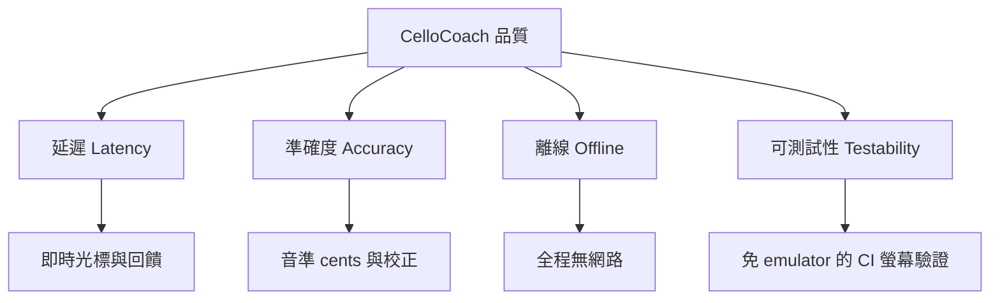

# 10. 品質需求（Quality Requirements）

本章定義 CelloCoach Android app 的品質目標，並以可驗證的情境（quality
scenario）描述。這些品質屬性直接驅動了
[9 章的架構決策](09_architecture_decisions.md)。

相關章節：

- 架構決策如何支撐這些品質 → [09_architecture_decisions.md](09_architecture_decisions.md)
- 威脅這些品質的風險與技術債 → [11_risks_and_technical_debt.md](11_risks_and_technical_debt.md)
- 名詞解釋 → [12_glossary.md](12_glossary.md)

## 10.1 品質樹（Quality Tree）

## 10.2 品質目標總覽

| 優先序 | 品質屬性 | 一句話目標 | 主要支撐決策 |
|---|---|---|---|
| 1 | 延遲 | 從拉出一個音到畫面回饋，延遲低到「練琴當下可用」 | [ADR-002](09_architecture_decisions.md#adr-002-裝置端音高偵測而非瀏覽器--flask-server)、[ADR-001](09_architecture_decisions.md#adr-001-原生-compose-canvas-樂譜渲染而非-webview--osmd) |
| 2 | 準確度 | 音準判定反映「演奏」而非「樂器走音」 | [ADR-002](09_architecture_decisions.md#adr-002-裝置端音高偵測而非瀏覽器--flask-server) + [tuning 校正](12_glossary.md#tuning-校正) |
| 3 | 離線 | 不需任何網路即可完整使用 | [ADR-001](09_architecture_decisions.md#adr-001-原生-compose-canvas-樂譜渲染而非-webview--osmd)、[ADR-002](09_architecture_decisions.md#adr-002-裝置端音高偵測而非瀏覽器--flask-server) |
| 4 | 可測試性 | 核心互動可在 devcontainer/CI 免 emulator 驗證 | [ADR-003](09_architecture_decisions.md#adr-003-robolectric-jvm-可執行的-uie2e-測試) |

## 10.3 品質情境（Quality Scenarios）

### 4.1 延遲（Latency）

> 學生拉出一個音，畫面上的「你拉」面板、cents 數字、status 顏色與光標應在
> 感知上「即時」更新，不打斷練習節奏。

| 項目 | 內容 |
|---|---|
| 來源 | 演奏者拉出/換一個音 |
| 刺激 | 麥克風收到新的穩定音高 |
| 環境 | App 在實機前景執行，練習進行中 |
| 回應 | 偵測 → follower → scorer → Compose 重組更新畫面 |
| 度量 | 端到端延遲目標 ≲ 100 ms（`AudioPitchSource` ~20 Hz 取樣 ≈ 50 ms 一格 + 偵測/重組）；ViewModel tick 50 ms（比照 `main.py` 的 tick loop） |

**支撐方式：** [ADR-002](09_architecture_decisions.md#adr-002-裝置端音高偵測而非瀏覽器--flask-server)
讓整條管線在同一 process、無網路往返；
[ADR-001](09_architecture_decisions.md#adr-001-原生-compose-canvas-樂譜渲染而非-webview--osmd)
去掉 WebView/JS bridge 的跨界成本。相關風險見
[11 章（吵雜環境延遲偵測穩定度）](11_risks_and_technical_debt.md#51-風險)。

### 4.2 準確度（Accuracy）

> 音準回饋衡量的是「演奏準不準」，而不是「這把琴有多走音」。

| 項目 | 內容 |
|---|---|
| 來源 | 演奏者 / 樂器 |
| 刺激 | 在已校正的琴上拉一顆音 |
| 環境 | 已完成 C→G→D→A 四弦校正 |
| 回應 | scorer 以該弦的 [cents](12_glossary.md#cents) 偏移為基準計算 [intonation](12_glossary.md#intonation-音準)；status 門檻 good <20¢ / close <50¢ / off ≥50¢ / wrong（MIDI 不符） |
| 度量 | 校正後同一顆正確音的 cents 接近 0；診斷能抓出整體偏移（≥10¢）、重複錯音、單弦系統性偏移（≥15¢） |

**支撐方式：** [ADR-002](09_architecture_decisions.md#adr-002-裝置端音高偵測而非瀏覽器--flask-server)
把偵測與 [tuning 校正](12_glossary.md#tuning-校正)放在同一程式碼庫，評分一致地
扣掉每弦偏移。相關限制見
[11 章（指法→弦對應簡化）](11_risks_and_technical_debt.md#52-技術債)。

### 4.3 離線（Offline）

> 在沒有網路（甚至飛航模式）的琴房，App 全部功能皆可用。

| 項目 | 內容 |
|---|---|
| 來源 | 使用者 |
| 刺激 | 在無網路環境啟動並完整練習一首曲子 |
| 環境 | 飛航模式 / 無 Wi-Fi |
| 回應 | 載入 assets 內的 MusicXML、渲染樂譜、麥克風偵測、評分、報告、校正存檔皆正常 |
| 度量 | 零網路請求；無 CDN/server 依賴；校正持久化於 `filesDir/tuning.json` |

**支撐方式：** [ADR-001](09_architecture_decisions.md#adr-001-原生-compose-canvas-樂譜渲染而非-webview--osmd)
（無 OSMD CDN）與 [ADR-002](09_architecture_decisions.md#adr-002-裝置端音高偵測而非瀏覽器--flask-server)
（無 Flask server）。

### 4.4 可測試性（Testability）

> 核心互動流程（校正、練習光標、回饋顏色、報告）能在 devcontainer/CI 上
> 免 emulator、決定性地驗證。

| 項目 | 內容 |
|---|---|
| 來源 | 開發者 / CI pipeline |
| 刺激 | 執行 `./gradlew testDebugUnitTest` |
| 環境 | devcontainer（無 emulator、無實體麥克風） |
| 回應 | JVM 單元測試（core 模組）+ Robolectric Compose UI/E2E 測試（注入 `FakePitchSource` 餵腳本音高） |
| 度量 | 全測試在 JVM 上跑完，不需 KVM/emulator；以 `testTag` 斷言光標與上色；follower 用注入 `Clock` 控制時間 |

**支撐方式：** [ADR-003](09_architecture_decisions.md#adr-003-robolectric-jvm-可執行的-uie2e-測試)
與 `PitchSource` / `Clock` 兩個可注入介面（見
[CONTRACTS.md](../../CONTRACTS.md)）。選用的 instrumented 煙霧測試補上真機驗證。

---

上一章：[9. 架構決策](09_architecture_decisions.md) ｜
下一章：[11. 風險與技術債](11_risks_and_technical_debt.md)
