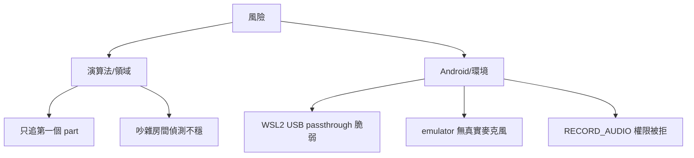

# 11. 風險與技術債（Risks and Technical Debt）

本章記錄 CelloCoach Android app 已知的風險與技術債，分為兩類：

1. **演算法/領域層**（從參考實作的「已知限制」延續而來）；
2. **Android/環境特定**（本次平台移植引入的新風險）。

相關章節：

- 引入這些取捨的決策 → [09_architecture_decisions.md](09_architecture_decisions.md)
- 受影響的品質目標 → [10_quality_requirements.md](10_quality_requirements.md)
- 名詞解釋 → [12_glossary.md](12_glossary.md)

## 11.1 風險

### 演算法/領域風險（延續參考實作）

| 風險 | 影響 | 緩解 / 現況 |
|---|---|---|
| **Score follower 只能往前**（forward-only） | 學生回頭重拉前段，光標不會倒回；timeout 會強制前進 | MVP 範圍內；倒退需 beam search，超出範圍。見 [score follower](12_glossary.md#score-follower-跟譜器) |
| **只追蹤第一個 part** | 多聲部曲目會跟到非主旋律聲部；伴奏譜會跟到鋼琴右手 | `ScoreLoader` 僅取第一個 part（見 [CONTRACTS.md](../../CONTRACTS.md)）；以單聲部教材為主 |
| **吵雜房間偵測不穩** | 環境噪音、其他樂器、共鳴會讓 [NSDF](12_glossary.md#nsdf) clarity 下降，產生漏抓或誤抓 | clarity 門檻 0.9 + cello 音域 [fmin,fmax]=[60,1100] 過濾；安靜環境效果最佳。對應 [延遲品質](10_quality_requirements.md#41-延遲-latency) |
| **無 OMR** | 只支援已有 MusicXML 的曲目，不能拍譜照辨識 | 設計外範圍；提供 assets 內建曲與外部 `.musicxml/.mxl` 載入 |

### Android/環境風險（本次移植新增）

| 風險 | 影響 | 緩解 / 現況 |
|---|---|---|
| **WSL2 USB passthrough 脆弱** | 在 WSL2 + devcontainer 下，實機 USB 部署需 `usbipd-win` bind/attach + 容器 `--privileged --device=/dev/bus/usb`；連線常因重插、休眠、Windows 更新而掉 | 提供兩條路：(a) USB passthrough；(b) host 跑 `adb -a nodaemon server` 搭配 `ADB_SERVER_SOCKET`（見 [devcontainer.json](../../.devcontainer/devcontainer.json) 與 [scripts/deploy-usb.sh](../../scripts/deploy-usb.sh)）。詳見 [WSL2](12_glossary.md#wsl2) |
| **emulator 無真實麥克風** | 虛擬麥克風無法收真實演奏音高，無法在 emulator 驗證即時音準 | CI/螢幕驗證改用 `FakePitchSource` 腳本音高（[ADR-003](09_architecture_decisions.md#adr-003-robolectric-jvm-可執行的-uie2e-測試)）；emulator 僅跑啟動煙霧測試 |
| **`RECORD_AUDIO` 執行期權限** | 使用者拒絕授權則無法偵測；需 UI 層處理請求流程 | UI 層取得權限，`AudioPitchSource` 假設已授權（見 [CONTRACTS.md](../../CONTRACTS.md)） |
| **emulator 需 KVM** | devcontainer 須以 `--device=/dev/kvm` 啟動，否則 instrumented 測試極慢/失敗 | devcontainer `runArgs` 已含 `/dev/kvm`；CI 用 [run-emulator-tests.sh](../../scripts/run-emulator-tests.sh) 以 swiftshader 軟體 GPU headless 啟動 |
| **裝置麥克風品質差異** | 不同手機麥克風頻響不同，影響 cents 準確度 | [tuning 校正](12_glossary.md#tuning-校正)以使用者自己的琴為基準，吸收部分差異 |

## 11.2 技術債

| 技術債 | 說明 | 償還方向 |
|---|---|---|
| **指法→弦對應簡化** | 高把位的音一律算成「最高開弦」來套校正偏移（差通常 < 5¢）。見 `Tuning.stringForMidi` / [open string](12_glossary.md#open-string-空弦) | 若要支援大跨度把位/拇指把位，需更細的把位推論 |
| **受限的原生樂譜渲染** | [ADR-001](09_architecture_decisions.md#adr-001-原生-compose-canvas-樂譜渲染而非-webview--osmd) 自繪五線譜，僅支援單聲部子集，複雜記譜（連音線、反覆、裝飾音）支援不足 | 視需求擴充 `ScoreView`，或在「需要完整排版」時再評估引擎 |
| **校正儲存無 schema 版本** | `filesDir/tuning.json` 是純文字 JSON，無 schema 版本管理；改格式可能要手動清舊檔（含 `savedAt` ISO 時間） | 加入版本欄位與遷移邏輯 |
| **MusicXML 解析自製** | 不用 music21，改以 JDK `javax.xml` 自解析（見 [CONTRACTS.md](../../CONTRACTS.md)），覆蓋的 MusicXML 特性有限 | 依實際曲目逐步補齊解析分支 |
| **Robolectric 渲染為近似** | Compose 在 Robolectric 下為 shadow 近似，像素級正確性需人工/instrumented 確認 | 關鍵畫面以選用 instrumented 測試補強 |

---

上一章：[10. 品質需求](10_quality_requirements.md) ｜
下一章：[12. 詞彙表](12_glossary.md)
